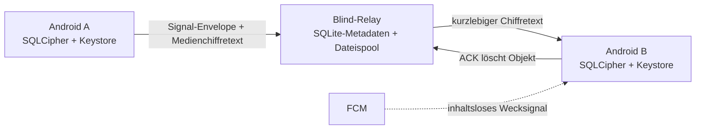

# Architektur

Love Doves besteht aus einer Android-App, einem kleinen Blind-Relay und einem
plattformneutralen Protobuf-Protokoll. Es gibt keine Konten, keine
Kontaktauflösung und keine serverseitig lesbare Paaridentität.

## Android

Der zufällige 256-Bit-Tresorschlüssel wird mit einem authentifizierungsgebundenen
AES-Schlüssel aus dem Android Keystore umhüllt. `BiometricPrompt` akzeptiert
starke Biometrie oder den sicheren Gerätecode. Nach Verlassen des Vordergrunds
werden Room/SQLCipher, Signal-Sitzung und der erreichbare Tresorschlüssel
geschlossen. Android-Backup ist deaktiviert und `FLAG_SECURE` schützt Fenster
und App-Übersicht.

Nachrichtentext, Medien-Metadaten, Signal-Identität, Sessions und Ratchet-Zustand
liegen in der SQLCipher-Datenbank. Jedes Foto, Video, Video-Vorschaubild und jede
Sprachnachricht hat einen eigenen zufälligen AES-256-GCM-Schlüssel und einen
UUID-Dateinamen. Aus
CameraX und Photo Picker wird direkt im Speicher ein JPEG ohne EXIF erzeugt.
CameraX schreibt Videoaufnahmen ohne App-Standortmetadaten direkt in einen
anonymen RAM-basierten Dateideskriptor. Importierte Videos werden dort ohne
Container-Metadaten neu geschrieben. Eine unverschlüsselte temporäre App-Datei
gibt es nicht. Sprachnachrichten werden als AAC in MPEG-4 ebenfalls direkt in
einen anonymen RAM-Dateideskriptor aufgenommen und erst danach verschlüsselt.

Für Hintergrundabrufe gibt es bewusst einen getrennten, nicht
authentifizierungsgebundenen Keystore-Schlüssel. Er schützt nur Relay-URL,
Mailbox-Lesecapability und optional die FCM-Installations-ID. Ein gesperrter Prozess kann
damit Chiffretext in den dauerhaften Transportpuffer laden, aber keinen Inhalt
entschlüsseln.

## Paarung

Ein moderner PQXDH-Prekey-Bundle ist für einen robust scanbaren Einzel-QR zu
groß. Deshalb enthält der QR nur eine zehn Minuten gültige, zufällige
Rendezvous-Referenz. Der vollständige `InviteV1` liegt selbst AES-GCM-
verschlüsselt im Relay. Vor Ort scannt A Einladung und Antwort; aus der Ferne
liegt das Geheimnis im URL-Fragment und gelangt nicht in den HTTP-Request.

Erst wenn beide Geräte denselben aus Identitätsschlüsseln und Einladungsnonce
abgeleiteten Sechs-Wort-Fingerprint biometrisch bestätigen, wird die Paarung
aktiv.

## Transport

Der Relay kennt zufällige Mailbox- und Objekt-IDs, gehashte Read-/Write-
Capabilities, Größe, Ablaufzeit und optional eine FCM-Installations-ID. Bodies sind
undurchsichtig. Ein erfolgreicher Download wird erst nach dem fsync-gesicherten
lokalen Spool bestätigt. ACKs löschen logisch sofort; der Aufräumer entfernt
Reste und spätestens nach 72 Stunden abgelaufene Objekte.

WebRTC ist nicht Teil des Nachrichtenwegs. Es bleibt für spätere Anrufe oder
große synchrone Direktübertragungen reserviert.
